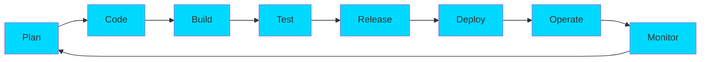

<div align="center">
  
</div>

<h3 align="center">🚀 Network Technology Undergraduate | Cloud & DevOps Engineer</h3>

<p align="center">
  
  
  
</p>

---

## 👨‍💻 About Me

```yaml
name: Madupa Dilshan
role: Cloud & DevOps Engineer
currently_seeking: Cloud/DevOps Internship
focus:
  - Infrastructure as Code (IaC)
  - CI/CD Pipeline Automation
  - Cloud Architecture (AWS)
  - Container Orchestration
  - System Administration
  
passion: |
  Building automated, scalable, and reliable infrastructure
  that enables teams to deploy faster and more efficiently.
```

🔭 **Currently Working On:** Automating cloud infrastructure using Terraform and AWS  
🌱 **Learning:** Kubernetes, Ansible, and AWS Advanced Architectures  
💬 **Ask Me About:** CI/CD, Docker, Jenkins, Terraform, AWS  
⚡ **Fun Fact:** I automate everything I do more than twice!

---

## 🛠️ Tech Stack & DevOps Tools

<table>
<tr>
<td valign="top" width="50%">

### ☁️ Cloud & Infrastructure
<div align="center">
  


</div>
</td>
<td valign="top" width="50%">

### 🔄 DevOps & CI/CD
<div align="center">
  


</div>
</td>
</tr>
<tr>
<td valign="top" width="50%">

### 💻 Programming Languages
<div align="center">
  


</div>
</td>
<td valign="top" width="50%">

### 🗄️ Databases & Backend
<div align="center">
  


</div>
</td>
</tr>
</table>

---

## 🎯 DevOps Practices

<div align="center">



</div>

<table>
<tr>
<td align="center" width="25%">

<br><strong>Infrastructure as Code</strong>
<br><sub>Terraform, CloudFormation</sub>
</td>
<td align="center" width="25%">

<br><strong>Containerization</strong>
<br><sub>Docker, Container Orchestration</sub>
</td>
<td align="center" width="25%">

<br><strong>CI/CD Automation</strong>
<br><sub>Jenkins, GitHub Actions</sub>
</td>
<td align="center" width="25%">

<br><strong>Cloud Architecture</strong>
<br><sub>AWS, Cloud Native Design</sub>
</td>
</tr>
</table>

---

## 📊 GitHub Analytics

<div align="center">
  
  
</div>

<div align="center">
  
</div>

<div align="center">
  
</div>

---

## 🏆 GitHub Trophies

<div align="center">
  
</div>

---

## 📫 Let's Connect

<div align="center">

[](https://madupadilshan.live)
[](https://linkedin.com/in/madupa-dilshan-3226711b1)
[](mailto:madupadilshan111@gmail.com)
[](https://github.com/madupadilshan)

</div>

---

<div align="center">
  
  
  ### 💭 Quote of the Day
  
  
  
  <sub>⭐️ From [madupadilshan](https://github.com/madupadilshan) with ❤️</sub>
</div>
