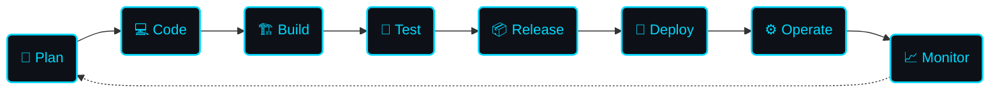

<!-- ═══════════════════════════════  HERO  ═══════════════════════════════ -->

<a href="https://madupadilshan.live">
  
</a>

<div align="center">


<br/>

[](https://madupadilshan.live)
[](https://linkedin.com/in/madupa-dilshan-3226711b1)
[](mailto:madupadilshan111@gmail.com)
[](https://x.com/MadupaDil)


&nbsp;


</div>

<br/>

<!-- ═══════════════════════════════  ABOUT  ═══════════════════════════════ -->

## &nbsp;👨‍💻&nbsp; About Me

> Network Technology undergraduate and Cloud & DevOps engineer building **automated, scalable, and reliable infrastructure** that lets teams ship faster. I turn manual, error-prone processes into repeatable pipelines — and I automate anything I have to do more than twice.

```yaml
madupa:
  role:      "Cloud & DevOps Engineer"
  based_in:  "Sri Lanka 🇱🇰"
  focus:
    - Infrastructure as Code (Terraform)
    - CI/CD Pipeline Automation
    - Containers & Orchestration (Docker, Kubernetes)
    - AWS Cloud Architecture (EC2, ECS, S3, VPC)
    - Linux System Administration
  currently_building:  "Automated AWS infrastructure with Terraform"
  currently_learning:  ["Kubernetes", "Ansible", "AWS advanced architectures"]
  ask_me_about:        ["CI/CD", "Docker", "Jenkins", "Terraform", "AWS"]
```

<br/>

<!-- ═══════════════════════════════  TECH STACK  ═══════════════════════════════ -->

## &nbsp;🧰&nbsp; Tech Stack & Tooling

<div align="center">

**☁️ Cloud & Infrastructure as Code**


**📦 Containers, Orchestration & Web Servers**


**🔄 CI/CD & Version Control**


**🐧 OS & Scripting**


**💻 Languages & App Development**


</div>

<br/>

<!-- ═══════════════════════════════  PROJECTS  ═══════════════════════════════ -->

## &nbsp;🚀&nbsp; Featured Projects

> Full-stack applications I've built end-to-end — now the focus is **containerizing them and automating their delivery** as part of my DevOps journey.

<table>
<tr>
<td width="50%" valign="top">

### 🧑‍💼 Job Board Platform
Full-stack MERN job portal with a decoupled **React** frontend and a **Node.js + Express + MongoDB** REST API — the kind of multi-service app that's ideal for a containerized CI/CD workflow.

`React` · `Node.js` · `Express` · `MongoDB`

[](https://github.com/madupadilshan/jobboardApp)
[](https://github.com/madupadilshan/jobboardBackend)

</td>
<td width="50%" valign="top">

### 🛒 E-Commerce Store
A **React** storefront with product browsing and cart flows, structured for a clean production build — a solid candidate for a Docker image behind Nginx and an automated deploy pipeline.

`React` · `JavaScript` · `CSS`

[](https://github.com/madupadilshan/ecommerce-store)

</td>
</tr>
<tr>
<td width="50%" valign="top">

### 📊 Real-Time Polling System
Create polls, vote, and watch results update **live** — built with **React** and **Firebase Firestore** for real-time synchronization across clients.

`React` · `Firebase` · `Firestore`

[](https://github.com/madupadilshan/online-polling-system)

</td>
<td width="50%" valign="top">

### 🌐 Developer Portfolio
My personal portfolio showcasing my Cloud & DevOps focus, skills, and projects — live and continuously updated.

`Web` · `Responsive` · `SEO`

[](https://madupadilshan.live)

</td>
</tr>
</table>

<br/>

<!-- ═══════════════════════════════  DEVOPS LIFECYCLE  ═══════════════════════════════ -->

## &nbsp;♾️&nbsp; The DevOps Lifecycle I Work Toward

<div align="center">


```mermaid
flowchart LR
    A(📝 Plan) --> B(💻 Code) --> C(🏗️ Build) --> D(🧪 Test)
    D --> E(📦 Release) --> F(🚀 Deploy) --> G(⚙️ Operate) --> H(📈 Monitor)
    H -.-> A

    classDef stage fill:#0D1117,stroke:#00D9FF,stroke-width:2px,color:#00D9FF;
    class A,B,C,D,E,F,G,H stage;
```

</div>

<br/>

<!-- ═══════════════════════════════  GITHUB STATS  ═══════════════════════════════ -->

## &nbsp;📊&nbsp; GitHub Activity

<div align="center">


<br/>


</div>

<br/>

<!-- Snake contribution graph — requires the snake GitHub Action (setup note in the message that accompanied this file) -->
<div align="center">
  <picture>
    <source media="(prefers-color-scheme: dark)" srcset="https://raw.githubusercontent.com/madupadilshan/madupadilshan/output/snake-dark.svg" />
    <source media="(prefers-color-scheme: light)" srcset="https://raw.githubusercontent.com/madupadilshan/madupadilshan/output/snake.svg" />
    
  </picture>
</div>

<br/>

<!-- ═══════════════════════════════  FOOTER  ═══════════════════════════════ -->

<div align="center">

### 💭 Philosophy

**`Automate everything you can — monitor everything you automate.`**

<br/>


<sub>⭐️ Thanks for visiting — let's build something reliable together.</sub>

</div>
